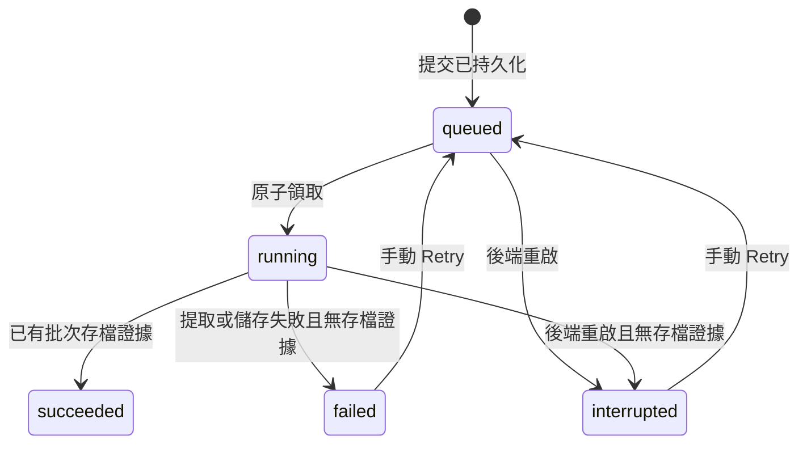

# 既有課程多頁匯入與背景提取規格書

- 日期：2026-10-02。
- 正式專案：`D:\python\TalkPath`。
- 狀態：使用者需求已確認；本文件記錄工程設計，功能尚未實作。
- 實作計畫：[多頁匯入實作計畫](../plans/2026-10-02-lesson-add-pages-background-implementation.md)。

## 1. 目標與界線

讓使用者從既有課程一次提交多張教材照片，離開前端後仍由後端提取；成功頁即時加入原課程，失敗頁可日後單獨重試。

使用者已確認：

1. 多頁只適用於 My Lessons → 課程詳情 → Add pages；新建課程維持一頁。
2. Program、Grade、Subject、Lesson、Textbook 唯讀，沿用選定課程；只選照片及逐張填頁碼。
3. 送出成功後回 My Lessons，顯示正在處理，其他操作可繼續。
4. 各頁獨立，成功頁加入原課程；某頁失敗不回滾成功頁。
5. 整批處理完成後顯示 MESSAGE，含成功／失敗頁數及課程連結，不自動跳到教材預覽。
6. 課程詳情保留失敗照片、頁碼及 Retry；只重試失敗頁。
7. 前端關閉或重新整理不取消後端工作；再次進入可查看狀態及結果。
8. 後端重啟保留成功頁；未完成頁標示中斷，手動 Retry，不自動重跑。
9. 處理中的頁面禁止重複提交或 Retry。

本次不加入先建課本再建內容、冊次、非數字課次、修改 textbook、取代舊頁、模型替換、新建課程背景提取、分散式工作佇列或多程序工作協調。

## 2. 現有程式證據

- `src/talkpath/application/session_service.py`：`import_lesson` 與 `generate_activity` 共用 `_operation_lock`，且匯入持鎖期間等待模型；這是匯入可能阻擋其他操作的程式證據，尚非使用者介面卡住的完整根因診斷。
- `upload_image` 預設設定照片引用期限為一小時；`validate_image_references` 會拒絕過期引用。日後 Retry 不能只保留舊 session／ImageReference。
- `_save_lesson_draft` 是現有唯一合併入口，依 `ImportBatch.operation_id` 避免重複追加；Pi internal tool 與外層匯入可能各呼叫一次。
- `src/talkpath/domain/models.py`：`CourseScope` 接受已有 textbook、但無 textbook 後綴的舊 ID；保留既有 scope 的明確 `lesson_id` 即可維持原課程歸屬，不需重命名課程或 migration。
- `LessonLensMarkdownRepository.save_lesson_draft` 使用 staging，最後發布 `lesson.md`，例外時嘗試回復；SQLite 與 Markdown 不共用交易，須處理「教材已存、工作狀態尚未更新」的窗口。
- `frontend/app.js`：`openLessonDetail` 讀取課程與 batches；session WebSocket 綁定學習 session，不適合用作跨導覽的匯入工作唯一狀態來源。

## 3. 架構選擇

| 做法 | 評估 |
|---|---|
| 只把原請求改成 `create_task`／BackgroundTasks | 不足以保留重啟狀態，也未處理全域鎖、過期照片及重複寫入 |
| SQLite 工作紀錄＋應用程式管理的非同步 worker | 採用；沿用現有非同步 provider，不增加外部服務，逐頁執行並保存狀態 |
| Redis／Celery 等外部佇列 | 增加部署與協調成本，超出本次 MVP |

工作 worker 使用與 FastAPI 相同事件迴圈；非同步 HTTP provider 繼續在此迴圈使用，不把共用 AsyncClient／Pi client 搬到另一個 thread 或另建事件迴圈。同步照片讀写、SQLite 及 LessonLens 存取透過 `asyncio.to_thread` 執行；課程合併與發布受同一 repository 的可重入鎖保護。worker 不依賴 HTTP 請求或 WebSocket 的存活。

MVP 為單一應用程序、單一頁面 worker，按提交及頁面順序處理；其他課程瀏覽、練習及語音操作不等待這個 worker 的模型請求。既有 Pi 邊界仍依其序列化能力運作，不承諾同一 Pi client 可同時執行多個 prompt。

新增單元：

- `domain/page_import.py`：頁面狀態、工作快照及提交／重試契約。
- `ports/page_import_repository.py`、`adapters/sqlite_page_import.py`：獨立工作儲存，使用既有 SQLite 檔，新表不改學習紀錄 schema。
- `application/page_import_service.py`：持久化提交、worker、單頁重試、恢復與通知。
- `api/page_import_routes.py`：多頁 API、保留照片讀取及獨立 WebSocket。
- `frontend/lesson-page-import.js`：上傳／重試協調與通知去重；`app.js` 僅接課程導覽及 DOM。

## 4. 工作與照片資料

一個 job 對應一次 Add pages 提交，一個 page 對應一張照片及頁碼標籤。一張跨頁照片可沿用既有 `12-13` 標籤；頁碼須為非空字串，重疊判定沿用 `normalize_pages`／`overlapping_pages`。

| 工作欄位 | 語意 |
|---|---|
| `job_id`、`operation_id` | 伺服器工作 ID、客戶端提交冪等 ID |
| `lesson_id`、`scope_json` | 使用者選定的實際課程 ID、後端讀取的課程身分快照 |
| `fingerprint` | 課程 ID、有序頁碼與照片 SHA-256 的請求摘要 |
| `revision`、`completion_revision` | 每次可見變動的版本；每輪全部終止時的完成版本 |
| `created_at`、`updated_at` | UTC 時間，前端按使用者時區顯示 |

| 頁面欄位 | 語意 |
|---|---|
| `page_id`、`ordinal`、`page_label` | 穩定頁面 ID、順序及使用者頁碼 |
| `status` | `queued`、`running`、`succeeded`、`failed`、`interrupted` |
| `source_key`、`sha256`、`mime_type`、`size_bytes` | 工作原圖的伺服器管理資訊，公開回應不含實體路徑 |
| `import_operation_id` | 固定為 `page-import:<page_id>`，各次 Retry 均保持不變 |
| `attempt_count`、`retry_operation_id` | 嘗試次數與最近一次重試的冪等 ID |
| `error_code`、`error_message` | 安全的可公開失敗分類與訊息 |

公開 job 狀態由頁面彙總：有 queued／running 為 `processing`，否則為 `completed`；同時提供 total／succeeded／failed／interrupted 計數。完成通知把 failed＋interrupted 計入未成功頁數，詳情仍區分失敗與中斷。Retry 會開啟同一 job 的下一輪，既有成功頁不歸零。

原圖存於 `settings.upload_root / "page-imports" / job_id / page_id`，只接受伺服器產生的安全 ID；不直接採用檔名或請求路徑。此目錄是工作原圖，不套用 session 引用的一小時期限；既有 upload 清理不得刪除它。成功、失敗與中斷頁的原圖及紀錄保留供本機工作恢復／查看，本期不新增清理或刪除介面。

每次處理或 Retry 建立全新的匯入 session，把保留原圖交給既有 `upload_image`，取得當次有效引用。scope 使用已保存課程的完整欄位及明確 lesson_id，只有 pages 改為當頁標籤。新 session 使用 `create_session()`，不能使用 `create_session(lesson_id=...)`，後者直接進入練習狀態而不能上傳。

## 5. 狀態、冪等與恢復

- 同一 operation_id、相同 fingerprint：回傳原 job，不新增工作；不同內容使用同 ID 回 409。
- 不同提交 ID 但同一課程、頁碼及照片摘要已有 queued／running 頁：回 409，附既有 job_id；Add anyway 不繞過此防護。
- Retry 只接受 failed／interrupted；以 SQLite compare-and-set 轉 queued。相同 retry_operation_id 重送回原結果，不重排；另一個 ID 要重試 queued／running／succeeded 頁回 409。
- 每次接受 Retry 同交易保存 operation_id／page_id receipt；較早的 Retry 請求延遲重送也只回最新快照，不新增嘗試。相同 Retry ID 用於另一頁回 409，不能只靠頁面上最近一次 ID 判斷。
- 寫入前及重試前檢查原課程 batches 的固定 import_operation_id。找到代表教材已發布，不再提取或合併，修正頁面為 succeeded。
- 啟動時，在接受 API 前檢查所有 queued／running：有已發布 batch 者為 succeeded，其餘為 interrupted；不自動排回 worker。failed／interrupted 若發現相同存檔證據也修正為 succeeded。
- 儲存後發生例外亦先查 batch 再決定 succeeded／failed，涵蓋 Pi 提前存檔或 SQLite 狀態更新失敗的窗口。讀取存檔證據失敗不得當作「尚未儲存」並重跑。
- 讀－合併－發布持有同一 LessonLens repository 可重入鎖；所有課程讀取亦使用此鎖，避免讀到發布一半的 bundle。模型等待期間不得持有此鎖。
- `import_lesson` 改用每 session 的匯入鎖；活動仍保留既有操作鎖。新增功能不擴大到整體 session state machine 重構。
- 關閉程序先停止接收工作、停止 worker，再關 provider；等待已開始的同步發布退出後才核對存檔證據及標示未完成頁。不得因取消 await 而讓 thread 仍寫入、卻開始下一次 Retry。

## 6. API 契約

| 路徑 | 契約 |
|---|---|
| `POST /api/lessons/{lesson_id}/page-imports/check` | JSON `{"pages":["12","13"]}`；按實際 lesson_id 檢查已儲存頁碼，回 overlapping_pages |
| `POST /api/lessons/{lesson_id}/page-imports` | multipart：`operation_id`、`pages`（JSON 字串陣列）、`allow_overlap`（布林）、重複 `files`；順序一一對應，成功回 202 job 快照 |
| `GET /api/lesson-page-imports` | 全部工作快照；可用 `lesson_id` 篩選，用於刷新後還原與重新連線 |
| `GET /api/lesson-page-imports/{job_id}` | 指定工作快照 |
| `POST /api/lesson-page-imports/{job_id}/pages/{page_id}/retry` | JSON `{"operation_id":"retry-..."}`；回 202 job 快照 |
| `GET /api/lesson-page-imports/{job_id}/pages/{page_id}/image` | 驗證 job/page 關係後傳回保留原圖，路徑由 repository 查得 |
| `WS /ws/lesson-page-imports` | 與學習 session 無關；連線先送工作快照，再送變動通知 |

提交須先完成所有輸入驗證及原圖持久化，再於單一 SQLite 交易建立 job/pages，之後排入 worker；202 表示工作已被接受，不代表教材完成。以 bounded read 沿用每張 `max_upload_bytes`，支援的 MIME 沿用 JPEG／PNG／WEBP／GIF。頁面數與檔案數須相等且非零，頁碼不能空白；不接受 program／grade／textbook 等身分欄位。建立交易失敗時清理本次未被紀錄引用的檔案，不能清理已存在的冪等提交。

404 用於不存在的課程／job/page；422 用於表單、頁碼或檔案驗證失敗；409 用於冪等衝突、處理中重送、不可 Retry 的狀態及尚未允許的頁碼重疊；儲存基礎設施失敗回 500。模型失敗反映於頁面狀態，保留安全訊息並繼續下一頁。

頁碼重疊沿用 Cancel／Add anyway 行為；新增 check 與提交驗證都直接查選定的 lesson_id，不透過重新推導身分查另一門課。Retry 沿用初次已接受的頁碼確認，不要求再次確認已成功的其他頁。

WebSocket 事件：`{"type":"page_import_updated","job":<快照>}`，或 `{"type":"page_import_snapshot","jobs":[<快照>]}`。狀態以 SQLite 查詢為準；先訂閱再取得快照，以 revision 忽略重複／舊事件，避免快照與訂閱間漏事件。斷線只解除訂閱，不取消 worker；重連及瀏覽器 focus 時重新 GET 校正結果，無須引入另一套持續 polling。

## 7. 前端行為

- 新增獨立 Add pages 畫面；課程資訊以唯讀文字呈現。照片列顯示縮圖、頁碼輸入與提交前移除入口；每個縮圖的 object URL 在移除／離開畫面時回收。
- 提交至收到 202 前顯示正在上傳並停用送出；只有收到接受結果才回 My Lessons。上傳失敗保留照片、頁碼及原 operation_id，供同內容重送。
- My Lessons 顯示工作進行狀態；課程詳情顯示 queued／running／failed／interrupted，只有後兩者出現 Retry。succeeded 內容沿用既有 batches 呈現。
- MESSAGE 放在跨畫面區域，以實際 job.lesson_id 導覽至課程詳情。事件不自動切換使用者目前畫面，也不修改當前練習 session。
- 每次 completion_revision 最多提示一次，已見版本存於帶命名空間的 localStorage；儲存不可用時退回記憶體。重新進入仍可在詳情查看完整結果。Retry 全部終止後產生新的完成版本及通知。
- 導覽或選課變更後的舊請求不得覆寫另一課程的畫面；通知仍可接受，因其屬跨畫面工作狀態。

## 8. 相容與驗收

不更改抽取提示詞、模型回應格式、現有 JSON 修復、content 去重或 Pi tool 契約。單頁 worker 呼叫現有 `import_lesson`；新增行為限於準備 session、鎖的範圍、同步儲存 offload、工作紀錄與前端入口。Pi 重複 save 必須繼續只產生一個 batch。

| 編號 | 驗收情境 |
|---|---|
| AC01 | 既有課程一次提交多頁，身分唯讀；新建課程仍一頁 |
| AC02 | textbook 已填但 ID 無後綴的舊課程仍寫回同一 ID，不新建另一課 |
| AC03 | 模型被測試閘門暫停時，提交已回 202，health／課程查詢／另一 session 活動仍可進行 |
| AC04 | 五頁中一頁失敗，四頁已儲存；詳情保留失敗照片與頁碼 |
| AC05 | Retry 只呼叫失敗頁，成功頁 batch、內容及圖片不重複 |
| AC06 | 關閉 WebSocket／前端不取消後端，重新連線或刷新取得結果 |
| AC07 | 後端重啟，queued／running 無存檔證據則中斷；已成功頁保留，無自動模型請求 |
| AC08 | 已存 Markdown、未更新 SQLite 的窗口可由 batch 校正；再次 Retry 不重複 |
| AC09 | 同提交 ID 重送、不同內容 ID 衝突、處理中相同照片重送、雙擊 Retry 都不重排 |
| AC10 | 原圖保留超過 session 引用期限仍能 Retry；路徑穿越、錯配 job/page、超量檔案受拒絕 |
| AC11 | 每輪完成通知含正確計數及課程連結，舊 revision 不覆蓋新狀態或重複提示 |
| AC12 | direct／Pi、既有單頁匯入、活動、聽力與朗讀回歸通過 |
| AC13 | 真實瀏覽器操作唯讀、多頁、離開／刷新、失敗 Retry、通知及頁碼警示，驗證不限於來源字串 |

驗證分為 fake provider 行為測試及人工瀏覽器流程；外部真實模型品質另行驗證，不以 fake 成功宣稱真實 provider 已通過。
